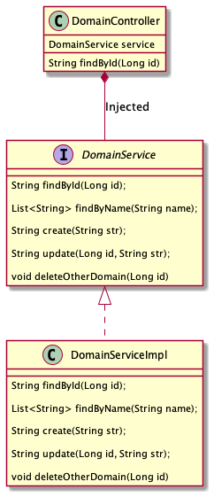
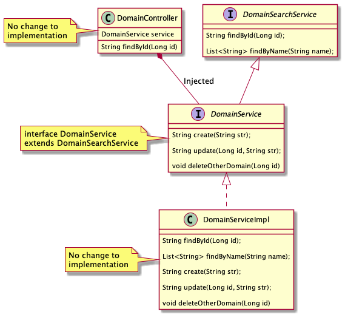
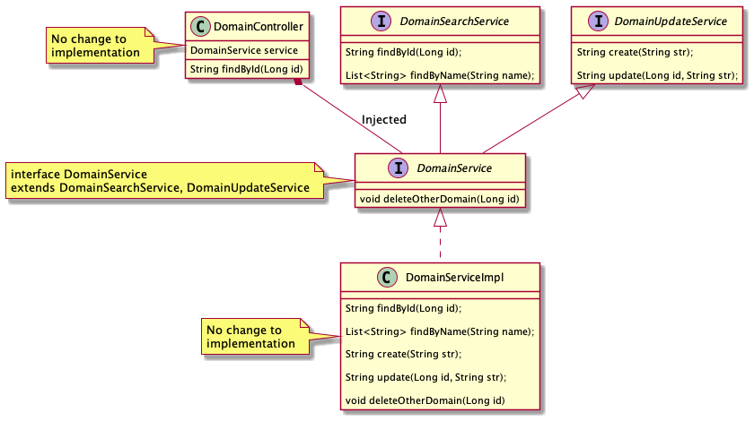
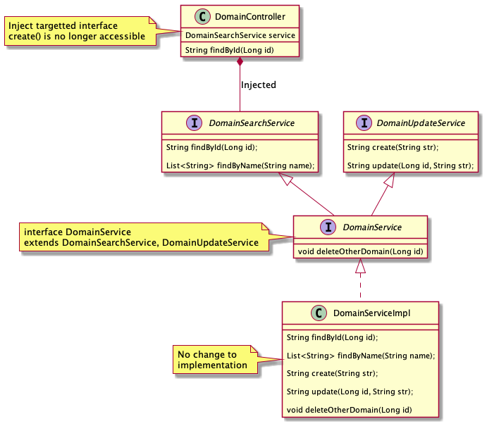
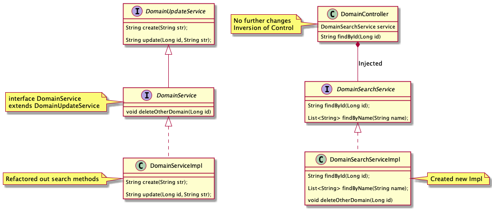

# Refactor Interfaces

## Overview
Sometimes when we have been building code for a while, we find ourselves with
certain classes that have grown organically. This kind of debt can lead to a
service doing too many things or cutting across too many concerns.

We have seen instances of java classes exceeding 20k LOC, and the associated 
Interface describes so many public methods that it is hard to grok what it 
should be doing. This pattern breaks the S in SOLID - single responsibility 
and can make for hard to maintain code.

This repo covers a very basic scenario and a way to slowly and methodically break 
down the code by decomposing the interfaces and getting out boundaries right, then 
breaking down the actual implementation into smaller, more manageable pieces.

## Scenario

We have a service called `DomainService` that we imagine has grown organically. Over
time people have added more and more public interfaces to it, crossing service
boundaries and generally not keeping up with the original intention of the 
service. The associated `Impl` has taken the hit, sometimes exceeding 20k LOC
and making it a hotspot for failure as nobody really knows what should or shouldn't
be in it.


# Interfaces
Interfaces are a great language feature - it allows us to describe behaviour agnostic of implementation.
There is a big push towards an API First mindset, with everyone getting serious about building robust 
and well thought out RESTful (and other) APIs for their customers to consume. There is no real difference 
between a RESTful API and the humble Java interface - both describe what a consumer 
can do and the contract in which they can do it.

A nice feature of Java interfaces is that they are composable - we can take many small interfaces and compose 
them into one big Interface. Conversely, we can take one big Interface and decompose it into many smaller 
interfaces. This will be our aim for this exercise.

# The process

## Step One
```shell
git checkout v1
```

We have a classic controller calling out to one of our uber-services, it looks something like the below.There is a 
`Controller` injecting the `DomainService` which gives it the ability to perform any and all actions available to it.
It looks fine in this form, but you might notice that `DomainService` has started bleeding out capability. It can perform
a `deleteOtherDomain` action, which isn't something we should be doing. Remember SOLID!



## Step Two
```shell
git checkout v2
```

Here is where we can start to leverage the power of composition and shape how we want our Domain interfaces
to behave. Keep in mind that this is an exercise, so I am not advocating **how** you should be decomposing your interfaces.
We will look to extract out all the operations relevant to searching the Domain - see the `DomainSearchService` Interface:



You will note that no changes have been done to any **Production** code apart from the addition of the new interface,
and the moving around of some public methods. The `DomainController` OR the `DomainServiceImpl` have not been modified.
That solid line with see-through arrow means `DomainService extends DomainSearchService`. 

### Step Two B
```shell
git checkout v3
```

If you like, we can keep going with the Interface refactor, and pull out all the things that might mutate the domain:



Again, notice how there is no impact to any real logic, just moving interfaces at this point. The `DocumentService` is
all but hollowed out - apart from that weird method that really belongs to some other domain.

## Step Three
```shell
git checkout v4
```

Now we can start to change who is referencing the `DomainService` - ultimately we want to refactor any service that
injects it to start to use one of the more specialised Interfaces:



Again, no real change here - probably we will need to fix up some unit tests that were presumably mocking out 
`DomainService` for `DomainSearchService`. Still, no logic changes present.

## Step Four
```shell
git checkout v5
```


Time to clean up the uber `Impl` file that has been bugging you for years. Create a new service and move over
the logic to implement the search features:



It is clear to see now that the `DomainController` is no longer using `DomainService`. Since we are at this point with
all existing interfaces, and we are in Spring IOC land - Spring does all of the heavy lifting to present `DomainController` 
with an instance of `DomainSearchServiceImpl` as opposed to `DomainServiceImpl`. Totally transparent at this point.

# Wrapping up the writeup

By following these small steps, we can slowly and methodically break down large Interfaces to get a better handle on
what our services and components **should** be doing, leading us to an easy task of refactoring out the large `Impl` 
classes with less and less risk.

# Running through the code

This repo has a number of tags. Check out `v1` to start at the beginning.

To run the application you can either start `RefactorInterfacesApplication` via IntelliJ or other IDE, or form your shell:
```shell
./mvnw spring-boot:run
```

`ctrl-C` will stop execution

You can check to see if your server is still responding via curl:
```shell
curl localhost:8080/domains/456
```
